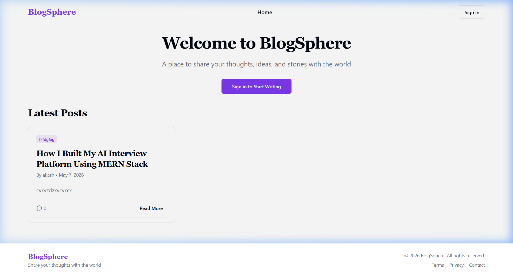

# Blog-Sphere — Modern Full-Stack Blogging Platform 

Welcome to **Blog-Sphere**, a fully-featured, production-ready full-stack web application built using the MERN stack (MongoDB, Express.js, React, Node.js). This portfolio-level project demonstrates modern web development practices including robust authentication, rich text editing, secure image uploads, responsive UI design, and cloud deployments.

---

## Live Demo
- **Frontend (Vercel):** [https://frontend-rust-two-70.vercel.app](https://frontend-rust-two-70.vercel.app)
- **Backend (Vercel):** [https://backend-beta-hazel-92.vercel.app](https://backend-beta-hazel-92.vercel.app)

---

## Features

### Core Functionality
- **User Authentication:** Secure JWT-based registration and login system with encrypted passwords (bcrypt.js).
- **Blog Management:** Full CRUD operations (Create, Read, Update, Delete) for blogs.
- **Rich Text & Markdown Editor:** Support for comprehensive markdown syntax formatting when writing blogs.
- **Image Uploading:** Direct secure integration with Cloudinary for handling blog thumbnails.
- **Interactions:** Users can like and comment on blog posts in real-time.
- **Search & Filtering:** Dynamic content discovery with search by title or tags.

### UI/UX Highlights
- **Modern Design:** Built with React, Tailwind CSS, and Shadcn UI.
- **Fully Responsive:** Flawless layout across desktops, tablets, and smartphones.
- **Dark Mode Support:** Integrated user-preference-based light/dark theme switching.
- **Optimized Performance:** Smooth animations with Framer Motion, optimized network queries with Axios, and skeleton loaders.
- **Toast Notifications:** Real-time feedback for user actions.

---

## Technology Stack

**Frontend:**
- **Framework:** React.js (Vite)
- **Styling:** Tailwind CSS, Shadcn UI
- **Routing:** React Router DOM
- **Editor:** @uiw/react-md-editor
- **HTTP Client:** Axios
- **State/Notifications:** Context API, Sonner
- **Date Formatting:** date-fns

**Backend:**
- **Runtime:** Node.js
- **Framework:** Express.js
- **Database:** MongoDB & Mongoose
- **Auth:** JSON Web Tokens (JWT), bcrypt.js
- **Storage:** Multer, Cloudinary

---

## Screenshots



---

## Installation & Local Setup

### Prerequisites
- Node.js (v18+)
- MongoDB Atlas Account (or Local MongoDB)
- Cloudinary Account (for image uploads)

### 1. Clone the repository
```bash
git clone https://github.com/gorkhagithub/Blog-Sphere.git
cd Blog-Sphere
```

### 2. Backend Setup
```bash
cd backend
npm install
```
Create a `.env` file in the `backend` folder and add the required environment variables (see next section).
```bash
npm run dev
```
The backend server will run on `http://localhost:5000`.

### 3. Frontend Setup
Open a new terminal window:
```bash
cd frontend
npm install
```
Create a `.env` file in the `frontend` folder:
```env
VITE_API_URL=http://localhost:5000/api
```
```bash
npm run dev
```
The React frontend will be available at `http://localhost:5173`.

---

## Environment Variables

### Backend (`/backend/.env`)
```env
PORT=5000
NODE_ENV=development
MONGO_URI=your_mongodb_connection_string
JWT_SECRET=your_super_secret_jwt_key
CLOUDINARY_CLOUD_NAME=your_cloudinary_name
CLOUDINARY_API_KEY=your_cloudinary_api_key
CLOUDINARY_API_SECRET=your_cloudinary_api_secret
```

### Frontend (`/frontend/.env`)
```env
VITE_API_URL=http://localhost:5000/api
```
*(In production, change this to your deployed backend URL)*

---

## Deployment Guide

### Deploying the Backend on Vercel
1. Create a `vercel.json` file in the `backend` folder to configure Serverless Functions.
2. In Vercel, import your GitHub repository and select the `backend` directory.
3. Add all the backend environment variables under the "Environment Variables" tab.
4. Click **Deploy**.

### Deploying the Frontend on Vercel
1. Log in to [Vercel](https://vercel.com/) and click **Add New Project**.
2. Import your GitHub repository.
3. Set the Root Directory to `frontend`.
4. The Build Command (`npm run build`) and Output Directory (`dist`) should be auto-detected for Vite.
5. In **Environment Variables**, add:
   - `VITE_API_URL` = `https://your-deployed-backend-url.com/api`
6. Click **Deploy**.
*(Routing is already configured for Vercel using the provided `vercel.json` file).*

---

## Contributing
Contributions, issues, and feature requests are welcome! 

---

## icense
This project is [MIT](https://choosealicense.com/licenses/mit/) licensed.

*Developed by Abhishek Gorkha*
